# Git

Git jest narzędziem służącym do kontroli wersji. Stanowi wolne oprogramowanie i podlega licencji [GNU GPL w wersji 2](https://www.gnu.org/licenses/old-licenses/gpl-2.0.html). Jest domyślnie zainstalowany w większości dostępnych dystrybucji systemu Linux i powszechnie używany przez programistów. Za jego pomocą możemy wygodnie zapisywać i śledzić zmiany w katalogu plików, a także współdzielić je z innymi użytkownikami. Git radzi sobie z plikami niezależnie od ich formatu (zatem nie służy wyłącznie do śledzenia zmian w kodzie źródłowym), jednakże wiele jego funkcjonalności ma zastosowanie tylko do plików tekstowych.

## Rozproszenie pracy

Git jest systemem rozproszonym. Oznacza to, że nie istnieje w nim jedno główne repozytorium (zarządzany przez Gita katalog plików). Repozytorium utworzone w katalogu na maszynie `X` możemy sklonować (`git clone`) do katalogu na maszynie `Y`, następnie:
1. Wprowadzić zmiany w repozytorium-klonie (edycja plików projektu)
2. Zapisać zmiany (`git add`, `git commit`).
3. Spropagować stan lokalnego repozytorium do oryginalnego (`git push` na maszynie `Y`, `git pull` na maszynie `X`).

W ten sposób każdy programista w zespole może pracować nad projektem lokalnie, bez stałego dostępu do zdalnego repozytorium - propagując zmiany tylko wtedy, gdy chce się nimi podzielić z resztą zespołu.

Git powstał z myślą o projektach, nad którymi pracują rozproszone zespoły programistów - stworzył go Linus Torvalds jako system kontroli wersji dla jądra Linux.

## Metawskazówki do scenariusza

<figure style="float:right;width:15em">
  
  <figcaption style="font-size:0.8em">
    Logo Gita. Autor:&nbsp;Jason&nbsp;Long. Licencja:&nbsp;CC&nbsp;BY&nbsp;3.0.
  </figcaption>
</figure>

Scenariusz otwieramy w IntelliJu (ew. w dowolnym innym programie z podglądem
plików `.md`). W menu u góry klikamy *File > Open...*
i w drzewie katalogów odszukujemy rozpakowany katalog `Scenariusz-do-Gita`.
Ważne, żeby wskazać katalog, a nie tylko zawarty w nim plik
`Scenariusz do Gita v3.md` – inaczej IntelliJ nie wyświetli obrazków. Wybór
katalogu zatwierdzamy przyciskiem *OK*, następnie w lewym panelu odszukujemy
plik `Scenariusz do Gita v3.md` i klikamy go dwukrotnie. Potem włączamy ładny
podgląd scenariusza, klikając ikonkę *Preview* w prawym górnym rogu ekranu.
Sprawdzamy, czy wyświetlają się obrazki – np. w prawej części tej sekcji
powinno wyświetlać się logo Gita. Jeśli go nie widać, to coś poszło nie tak –
warto poprosić prowadzącego o pomoc.

Opisywane w scenariuszu komendy można wykonywać na bieżąco lub skupić się tylko
na czytaniu. Po każdym większym fragmencie scenariusza jest zadanie, które
pozwala przećwiczyć poznane komendy w praktyce (warto je zrobić niezależnie od
sposobu realizowania scenariusza). W wersji "na bieżąco" warto podzielić
ekran na pół między IntelliJa a terminal.

Zadania (i ogólnie scenariusz) wykonujemy, korzystając z prostego edytora
tekstowego (np. Gedit, Nano, Vim), komend Gita w terminalu i programu Gitk
do wizualizacji repozytorium. IntelliJ ma tylko wyświetlać treść scenariusza.
IntelliJ oferuje co prawda własny interfejs do obsługi Gita, ale w tym
scenariuszu z niego nie korzystamy – żeby nauczyć się obsługi Gita w terminalu
i lepiej zrozumieć jego mechanizmy. Dzięki temu będziemy mogli korzystać z Gita
też na innych przedmiotach, niezależnie od języka programowania czy używanych
tam narzędzi.

Wszystkie potrzebne programy są już zainstalowane na komputerach w
laboratorium. Po zajęciach można zainstalować je także na własnym komputerze –
opis jest w sekcji [Instalacja](#instalacja) w Dodatku.

# Praca na lokalnym repozytorium

## Inicjalizacja

Utwórzmy lokalny katalog o nazwie `projekt`. Będzie to główny katalog naszego projektu.

```bash
$ mkdir projekt
```

Teraz wejdźmy do tego katalogu i spróbujmy użyć Gita.

```bash
$ cd projekt
$ git status
fatal: not a git repository (or any of the parent directories): .git
```

Program Git poinformował nas, że nie znajdujemy się obecnie w żadnym repozytorium - nie jest nim ani nasz obecny katalog roboczy, ani żaden z zawierających go katalogów. Stwórzmy zatem repozytorium, które obejmuje nasz katalog roboczy.

```bash
$ git init -b main
Initialized empty Git repository in ~/repozytorium/.git/
```

Dygresja: Argument `-b main` polecenia `git init` ustala nazwę głównej gałęzi repozytorium. Domyślną (i wciąż dość rozpowszechioną) nazwą jest `master`. Natomiast od ok. 2020 roku odradza się jej używanie ze względu na jej negatywne konotacje w USA (master vs slave). Inne spotykane nazwy to oprócz `main` także `trunk`, `primary` czy `development`.

Zobaczmy, czy wywołanie `git init` coś w naszym projekcie zmieniło.

```bash
$ ls -a
. .. .git
```

W projekcie pojawił się ukryty folder o nazwie `.git`. W tym folderze Git będzie zapisywać wszystkie dane, których potrzebuje do zarządzania repozytorium. W większości przypadków nie należy edytować go ręcznie i można zapomnieć o jego istnieniu - zarządzać nim będzie Git. 

Przydatnym poleceniem do zorientowania się, jaki jest stan repozytorium, jest `git status`.

```bash
$ git status
On branch main

No commits yet

nothing to commit (create/copy files and use "git add" to track)
```

Git poinformował nas o trzech rzeczach:
1. Aktualnie repozytorium znajduje się na gałęzi (branchu) o nazwie `main`
2. Na gałęzi `main` nie ma żadnych commitów
3. W repozytorium nie ma żadnych zmian

## Pierwszy commit

Nie przejmując się na razie gałęziami, spróbujmy utworzyć pierwszego commita.

Commit reprezentuje zestaw zmian w plikach projektu i jest podstawowym budulcem repozytorium. Dokładniej - repozytorium Git jest acyklicznym grafem, w którym węzłami są commity. Prześledzenie historii commitów od początku repozytorium do wybranego commita i nałożenie po kolei odpowiadających im zmian skutkuje odbudowaniem stanu repozytorium z wybranego punktu w czasie.

Spróbujmy teraz wprowadzić jakieś zmiany w projekcie. Utworzymy plik `Main.java` i umieścimy w nim prosty program.

```bash
$ touch Main.java
$ nano Main.java
```

Zamiast programu Nano możemy oczywiście użyć preferowanego przez nas edytora tekstu. Umieśćmy w pliku `Main.java` następujący program:

```java
public class Main {
    public static void main(String[] args) {
        System.out.println("Hello world!");
    }
}
```

Teraz zobaczmy, co o tym myśli Git.

```bash
$ git status
On branch main

No commits yet

Untracked files:
  (use "git add <file>..." to include in what will be committed)
	Main.java

nothing added to commit but untracked files present (use "git add" to track)
```

Git poinformował nas, że w katalogu znajduje się nowy plik, który nie jest "śledzony". To znaczy, że nie znajdował się wcześniej w repozytorium. W celu utworzenia naszego commita musimy najpierw powiedzieć Gitowi, żeby przygotował nasz plik do zacommitowania.

```bash
$ git add Main.java
$ git status
On branch main

No commits yet

Changes to be committed:
  (use "git rm --cached <file>..." to unstage)
	new file:   Main.java
```

Plik `Main.java` został dodany do przechowalni plików do zacommitowania. W przechowalni Git pamięta konkretną wersję pliku. Jeśli zmodyfikujemy plik już po wykonaniu `git add`, powinniśmy zaktualizować przechowalnię, powtarzając wywołanie `git add`. Plik z przechowalni można usunąć komendą zaproponowaną przez Gita powyżej.

Jeżeli sprawdzimy zawartość pliku `Main.java`, okaże się, że nie zaszła w nim żadna zmiana. Do śledzenia stanu repozytorium Git posługuje się jedynie ukrytym katalogiem `.git`.

Utwórzmy commita ze zmian, które umieściliśmy w przechowalni.

```bash
$ git commit
```

W trakcie wykonywania tej komendy Git prawdopodobnie otworzył dla nas edytor tekstowy z prośbą o wpisanie komentarza dla nowego commita. Jeśli nie umiemy obsługiwać wybranego przed Gita edytora, możemy łatwo go zmienić w konfiguracji Gita (patrz dodatek [Konfiguracja](#konfiguracja)). Możliwe też, że zamiast otworzyć edytor, Git nakrzyczał na nas za brak skonfigurowanej nazwy i adresu mailowego użytkownika. Rozwiązanie tego problemu jest również w dodatku [Konfiguracja](#konfiguracja).

Wróćmy do kwestii komentarza commita. Każdy commit musi mieć komentarz. Zgodnie z zasadami sztuki komentarze powinny w zwięzły i zrozumiały sposób opisywać zmiany, które niosą ze sobą commity. W ten sposób inni programiści (i my sami następnego dnia) wiedzą, czego mogą się po nich spodziewać. Ułatwia to szukanie w historii projektu konkretnych zmian.

Możemy pominąć niewygodny krok wpisywania treści komentarza w edytor tekstu, wywołując komendę w poniższy sposób:

```bash
$ git commit -m "Proste Hello world"
[main (root-commit) 5ef9e31] Proste Hello world
 1 file changed, 0 insertions(+), 0 deletions(-)
 create mode 100644 Main.java
$ git status
On branch main
nothing to commit, working tree clean
```

## Zmiana istniejącego pliku

Spróbujmy teraz wprowadzić nowe zmiany do projektu, dodając komentarz do pliku `Main.java`.

```java
public class Main {
    public static void main(String[] args) {
        System.out.println("Hello world!"); // a friendly greeting
    }
}
```

Zobaczmy, co na to powie Git.

```bash
$ git status
On branch main
Changes not staged for commit:
  (use "git add <file>..." to update what will be committed)
  (use "git restore <file>..." to discard changes in working directory)
	modified:   Main.java

no changes added to commit (use "git add" and/or "git commit -a")
```

Podobnie jak poprzednio, dostaliśmy informację o zmianach, które nie są przygotowane do zacommitowania. Możemy dodać je do przechowalni komendą `git add` i zacommitować przez `git commit`.

**Zadanie 1**
* Utwórz katalog `zadanie1` a w nim nowe repozytorium Gita.
  * Wskazówka: Katalog `zadanie1` utwórz poza katalogiem ze scenariuszem, żeby IntelliJ nie próbował się wtrącać do zarządzania naszym repozytorium.
* Napisz program Hello world i utwórz z niego commita.
* Wykonaj `git status` i sprawdź, że plik `Main.java` nie ma niezacommitowanych zmian.
* Dodaj komentarz `// a friendly greeting` i utwórz drugiego commita.
* Ponownie wykonaj `git status` i sprawdź, że plik `Main.java` nie ma niezacommitowanych zmian.

## Przeglądanie historii repozytorium

Do oglądania historii repozytorium będziemy używać programu Gitk. Wygodnie
uruchamia się
go, wykonując komendę `gitk --all &` w katalogu projektu. Flaga `--all`
wyświetla wszystkie gałęzie (sekcja o gałęziach już niebawem), a znak `&`
uruchamia program w tle, nie blokując terminala.

Nasze repozytorium wygląda obecnie tak:

<!--
  Cały tag `img` musi być w jednej linii, bo inaczej IntelliJ nie wyświetli
  obrazka.
-->
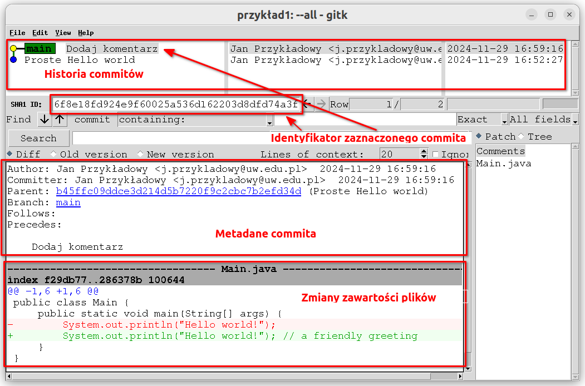

Panel u góry programu pokazuje historię commitów. Dla każdego commita panel
wyświetla pierwszą linię opisu commita, autora oraz datę.

Kropki połączone linią (po lewej stronie panelu) przedstawiają graf commitów.
W tym momencie struktura grafu jest dość prosta (liniowa), natomiast w dalszej
części scenariusza pojawią się ciekawsze grafy (w sekcji Gałęzie).
Zielona etykieta z napisem `main` reprezentuje główną gałąź programu i wskazuje
na najnowszy commit należący do tej gałęzi.

Po kliknięciu na wybrany commit z historii program wyświetli szczegóły tego
commita (wiersz z wybranym commitem ma wyszarzone tło). Centralna część
interfejsu wyświetla pełny opis commita (tutaj akurat ma tylko jedną linię)
i różne metadane commita. Poniżej wyświetlone są wszystkie zmiany
poszczególnych plików wprowadzane w ramach commita. Dodanie komentarza w pliku
`Main.java` Git potraktował jako usunięcie starej linii i dodanie nowej
(znaki `-` i `+` z lewej strony). Ten sposób prezentowania zmian jest jedną z
funkcjonalności Gita, które działają tylko dla plików tesktowych (na szczęście
większość plików w projektach informatycznych jest tekstowa).

Długi ciąg znaków `6f8e18fd924e9f60025a536d162203d8dfd74a3f` w polu `SHA1 ID`
to unikalny hasz commita,
wyliczony w sposób deterministyczny z danych i metadanych commita.
Za jego pomocą możemy zidentyfikować dany commit. Zwykle wystarczy podanie
prefiksu (np. pierwszych 8 znaków) tego hasza – jeśli prefiks jest unikalny,
Git domyśli się, o który commit chodzi.

Wskazówka: Gitk nie śledzi aktywnie stanu repozytorium. Warto co jakiś czas
odświeżać widok, wciskając `F5` lub `Shift`+`F5`.

Zwróćmy jeszcze uwagę na to, że programu Gitk używamy tylko do odczytu i
wizualizacji historii repozytorium i poszczególnych commitów, natomiast w żaden
sposób nie modyfikujemy nim stanu repozytorium (ani plików projektu).
Do wprowadzania zmian w repozytorium korzystamy z komend Gita w terminalu.

Jeśli nie mamy dostępu do graficznego narzędzia do wizualizacji (takiego jak
Gitk), możemy użyć następujących komend w terminalu:
* `git log --all --graph`: wyświetla historię i graf commitów.
* `git show <hasz-commita>`: wyświetla metadane i zawartość wybranego commita.

## Ignorowanie wybranych plików

Przy pomocy komendy `git add` możemy wskazywać Gitowi poszczególne pliki jako przygotowane do zacommitowania. Możemy również wskazać cały katalog - zamiast nazwy pliku wystarczy wtedy użyć nazwy katalogu. Jednakże nie wszystkie lokalne pliki powinny znaleźć się w repozytorium. Na przykład kiedy skompilujemy nasz program przy użyciu polecenia `javac Main.java`, w katalogu pojawi się plik wynikowy o nazwie `Main.class`.
Takich skompilowanych źródeł projektu zazwyczaj nie chcemy umieszczać w repozytorium. Na szczęście Git przewiduje takie sytuacje.

W specjalnym pliku o nazwie `.gitignore` możemy umieścić wzorce nazw plików i katalogów, które Git ma ignorować - takie pliki i katalogi nie będą pojawiać się w wynikach komend Gita, nie będą również brane pod uwagę podczas obsługi komendy `git add`. Składnia pliku `.gitignore` jest całkiem bogata - obsługiwane wzorce można znaleźć [tutaj](https://www.atlassian.com/git/tutorials/saving-changes/gitignore#git-ignore-patterns).

**Zadanie 2**
* Utwórz katalog `zadanie2` i rozpakuj w nim archiwum `przyklady/hello.zip`.
  * Rozpakowany katalog `hello` zawiera gotowe repozytorium Gita (z utworzonymi już dwoma commitami). Nie trzeba wykonywać komend w rodzaju `git init`.
* W rozpakowanym repozytorium wykonaj `git status`, uruchom program Gitk i obejrzyj historię commitów.
  * Nieistotne wyjaśnienie: Zaraz po rozpakowaniu repozytorium (a przed `git status`) Gitk (błędnie) sugerowałby, że w repozytorium są niezacommitowane zmiany. To drobny efekt uboczny sposobu pakowania przykładów, który znika po wykonaniu dowolnej komendy Gita.
* Skompiluj plik `Main.java`.
* Spróbuj samodzielnie utworzyć plik `.gitignore` i przy jego pomocy wyłączyć z repozytorium plik `Main.class`.
* Następnie, w celu przygotowania projektu na przyszłe zmiany, spróbuj wyłączyć z repozytorium wszystkie pliki o rozszerzeniu `.class` - niezależnie od tego, gdzie w projekcie się znajdą.
* Dodaj plik `.gitingore` do repozytorium w osobnym commicie.
* Wywołaj polecenie `git status` i sprawdź, że Git ignoruje plik `Main.class`.
  * Git powinien stwierdzić, że nie ma niczego do zacommitowania, mimo że `Main.class` nie został dodany do repozytorium.

Repozytorium Git może zawierać wiele plików `.gitignore` umieszczonych w różnych katalogach. Każdy `.gitignore` wpływa na zachowanie Gita jedynie w zakresie katalogu, w którym jest umieszczony. Załóżmy następującą strukturę projektu:
```
- projekt
  - .gitignore
  - Main.java
  - Main.class
  - logi.logs
  - pakiet
    - .gitignore
    - InnaKlasa.java
    - InnaKlasa.class
    - logi.logs
```

Plik `projekt/.gitignore` wyłącza z repozytorium wszystkie pliki o rozszerzeniu `.class`, a plik `projekt/pakiet/.gitignore` - wszystkie pliki o rozszerzeniu `.logs`. W tej sytuacji pliki `projekt/Main.class`, `projekt/pakiet/InnaKlasa.class` oraz `projekt/pakiet/logi.logs` będą ignorowane przez Gita. Jednakże plik `projekt/logi.logs` nie będzie ignorowany, ponieważ zakres drugiego pliku `.gitignore` ogranicza się do jego katalogu.

# Gałęzie

## Wstęp

W projektach informatycznych często pracuje się nad kilkoma funkcjonalnościami
jednocześnie i niezależnie (zwłaszcza w projektach zespołowych). Do obsługi
takiego trybu pracy Git proponuje rozwiązanie nazywane gałęziami (branches).
Gałąź jest (w pewnym sensie) odnogą repozytorium, która zaczyna się od
określonego commita i pozwala na modyfikowanie kodu projektu w oderwaniu od
prac toczących się na innych gałęziach.

## Praca na gałęzi

Wróćmy do naszego repozytorium "Hello world" (w razie potrzeby jest
w pliku `hello.zip`). Na ten moment repozytorium ma tylko
jedną gałąź – `main`.

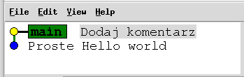

Rozbudujemy zaraz nasz program tak, aby wypisywał na standardowe wyjście
wszystkie swoje argumenty. Żeby nie robić zamieszania na gałęzi `main`
commitami z niedokończoną funkcjonalnością, całą pracę wykonamy na osobnej
gałęzi – `wypisz-argumenty`. Na koniec włączymy tę gałąź z powrotem do
gałęzi `main`.

Zacznijmy od utworzenia nowej gałęzi:
```bash
$ git branch wypisz-argumenty
```

Przy aktualnym commicie pojawiła się druga zielona etykietka, oznaczająca
nową gałąź `wypisz-argumenty`:

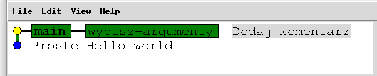

Przełączmy się teraz na gałąź `wypisz-argumenty`:

```bash
$ git checkout wypisz-argumenty
Switched to branch 'wypisz-argumenty'
```

Program Gitk potwierdza, że aktywną gałęzią jest teraz `wypisz-argumenty` –
pogrubienie czcionki przeszło z gałęzi `main` na `wypisz-argumenty` (trzeba
odświeżyć widok wciskając `Shift`+`F5`):

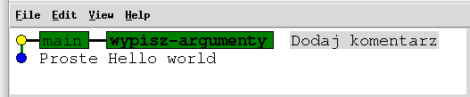

Od teraz wszystkie komendy Gita będą domyślnie dotyczyły gałęzi 
`wypisz-argumenty`. W szczególności wszystkie nowe commity Git będzie dodawał
do gałęzi `wypisz-argumenty`, a gałąź `main` pozostanie niezmieniona.

Zmodyfikujmy teraz nasz program tak,
aby na początku działania wypisywał swoje argumenty. Następnie utwórzmy z tych
zmian commita – dokładnie tak samo, jak na początku scenariusza:

```bash
$ git add Main.java
$ git commit -m 'Wypisuj argumenty'
[wypisz-argumenty 75005af] Wypisuj argumenty
 1 file changed, 6 insertions(+), 1 deletion(-)
```

Nowy commit pojawił się na gałęzi `wypisz-argumenty`, a gałąź `main` wciąż
wskazuje na poprzedni commit:

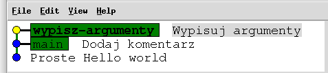

Dodajmy jeszcze dwa nowe commity – jeden przenoszący wpisywanie argumentów do
metody pomocniczej, a drugi dodający wypisywanie numerów argumentów. W efekcie
nasze repozytorium wygląda tak:

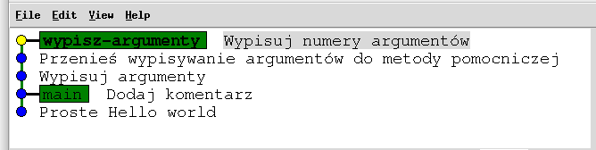

(jest w pliku `hello-przewijanie.zip` w razie potrzeby)

A plik `Main.java` wygląda tak:

```Java
public class Main {
    public static void main(String[] args) {
        printArguments(args);

        System.out.println("Hello world!"); // a friendly greeting
    }

    private static void printArguments(String[] args) {
        System.out.println("Arguments:");
        for (int i = 0; i < args.length; i++) {
            System.out.printf("Argument %d: %s\n", i, args[i]);
        }
    }
}
```

Nowa funkcjonalność jest już gotowa do włączenia do gałęzi `main`. Zajmiemy
się tym w kolejnej sekcji.

## Scalanie z przewijaniem

Przełączmy się na gałąź `main`:
```bash
$ git checkout main
```

Aktywną gałęzią jest znowu gałąź `main` (pogrubiona etykietka). Od teraz
wszystkie komendy Gita będą dotyczyły właśnie tej gałęzi. Żółta kropka
przesunęła się do commita *Dodaj komentarz* – Git przywrócił plik `Main.java`
do wersji sprzed wypisywania argumentów.

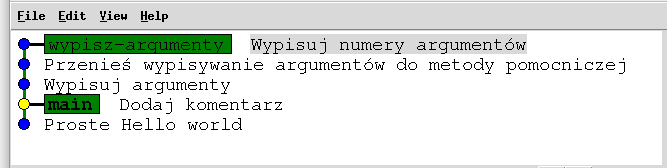

Teraz czas na propagację zmian z gałęzi `wypisz-argumenty` do gałęzi `main`.
W tym celu użyjemy komendy `git merge`:
```bash
$ git merge wypisz-argumenty
Updating 6f8e18f..aac7a3b
Fast-forward
 Main.java | 10 +++++++++-
 1 file changed, 9 insertions(+), 1 deletion(-)
```

Efekt:

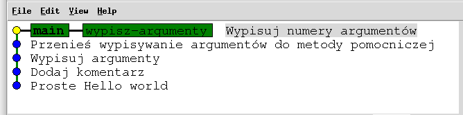

Git zauważył, że przez cały czas naszej pracy nad gałęzią `wypisz-argumenty`,
na gałęzi `main` nie powstał żaden nowy commit. Historia jest liniowa i nie
ma rozwidleń. Dzięki takiej strukturze repozytorium scalenie zmian z obu gałęzi
jest bardzo proste – wystarczy dosunąć (przewinąć) etykietkę gałęzi
`main` do etykietki gałęzi `wypisz-argumenty`.
Takie scalanie nazywane jest *fast-forward* (patrz komunikat od `git merge`),
a po polsku *scalanie z przewijaniem*.

Ukończyliśmy pracę nad wypisywaniem argumentów i wcieliliśmy zmiany do gałęzi
`main`. Możemy teraz usunąć roboczą gałąź poleceniem:

```bash
$ git branch -d wypisz-argumenty
```

**Zadanie 3**
* Utwórz katalog `zadanie3`, rozpakuj w nim (znane nam już) repozytorium
  `hello.zip` i wykonaj `git status`.
* Obejrzyj repozytorium w programie Gitk.
* Utwórz gałąź `dodatkowe-komunikaty`.
* Dodaj na tej gałęzi wypisywanie liczby argumentów programu (długość tablicy
  `args`) i utwórz z tych zmian commita.
* W kolejnym commicie dodaj wypisywanie komunikatu końcowego (np. `See you!`).
* Włącz zmiany z gałęzi `dodatkowe-komunikaty` do gałęzi `main`.
* Usuń gałąź `dodatkowe-komunikaty`.
* Sprawdź w Gitku, że etykietka `main` jest przy commicie z komunikatem
  końcowym, a etykietki `dodatkowe-komunikaty` już nie ma.

## Scalanie trójstronne

Przypuśćmy, że zanim wcieliliśmy zmiany z gałęzi `wypisz-argumenty` do gałęzi
`main`, ktoś inny (lub my sami) dodał nowy commit bezpośrednio do gałęzi `main`.

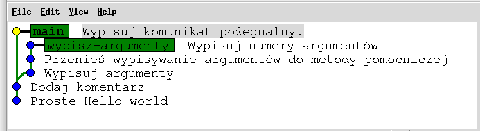

(repozytorium jest w pliku `hello-trojstronne.zip` w razie potrzeby)

W tym przypadku historia się rozwidla i proste przesunięcie
etykietki `main` nie jest możliwe.

Git musi:
* znaleźć ostatniego wspólnego przodka (miejsce rozwidlenia),
* porównać zmiany z gałęzi `main` ze zmianami z gałęzi `wypisz-argumenty`,
* scalić zmiany z obu gałęzi,
* utrwalić otrzymany stan projektu w postaci nowego commita (ilustracja
poniżej).

Takie scalenie nazywamy *scaleniem trójstronnym*
(*3-way merge*). Git porównuje stan projektu z miejsca
rozwidlenia i stany z dwóch scalanych gałęzi.

Na szczęście sekwencja komend, które musimy wykonać, pozostaje dokładnie taka
sama, jak przy scalaniu z przewijaniem. Git sam wybierze odpowiedni sposób
scalenia.

```bash
$ git merge wypisz-argumenty
Auto-merging Main.java
Merge made by the 'ort' strategy.
 Main.java | 10 +++++++++-
 1 file changed, 9 insertions(+), 1 deletion(-)
```

Git, obsługując komendę `git merge`, otworzył edytor tekstowy i zaproponował
nazwę łączącego commita, którą w razie potrzeby możemy zmienić.
My pozostaliśmy przy domyślnej
nazwie i otrzymaliśmy następujący stan repozytorium:

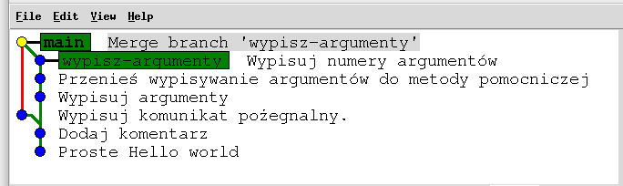

Z kolei plik `Main.java` wygląda teraz tak:

```Java
public class Main {
    public static void main(String[] args) {
        printArguments(args);

        System.out.println("Hello world!"); // a friendly greeting

        System.out.println("See you later, alligator!");
    }

    private static void printArguments(String[] args) {
        System.out.println("Arguments:");
        for (int i = 0; i < args.length; i++) {
            System.out.printf("Argument %d: %s\n", i, args[i]);
        }
    }
}
```

Git sprytnie domyślił się, jak poukładać kolejne fragmenty pliku `Main.java`
(modyfikowanego przecież niezależnie na gałęzi `wypisz-argumenty` i `main`!).
Git kieruje się tu względną kolejnością linii modyfikowanych przez każdą z
gałęzi.

Czasami jednak automatyczne uzgodnienie zmian z dwóch gałęzi nie jest możliwe
(np. gdy dwie gałęzie modyfikują tę samą linię na dwa różne sposoby). Mówimy
wtedy o konflikcie. Git poprosi nas wówczas o ręczne ustalenie, jak sporny
fragment ma ostatecznie wyglądać. Dokładniejszy opis jest w dodatku
[Konflikty](#konflikty) u dołu scenariusza.

**Zadanie 4**
* Utwórz katalog `zadanie4`, rozpakuj w nim repozytorium
  `hello-trojstronne.zip` i wykonaj `git status`.
* Obejrzyj repozytorium w programie Gitk.
* Na gałęzi `wypisz-argumenty` dodaj nowy commit, który zmieni numerację
  wypisywanych argumentów tak, aby pierwszy wypisywany argument miał numer 1
  (a nie 0).
* Włącz zmiany z gałęzi `wypisz-argumenty` do gałezi `main`.
* Usuń gałąź `wypisz-argumenty`.
* Sprawdź w Gitku, że graf commitów po rozwidleniu złączył się z powrotem,
  etykietka `main` jest przy commicie łączącym, a etykietki `wypisz-argumenty`
  już nie ma.

## Skok do stanu repozytorium z przeszłości

Do tej pory polecenia `git checkout` używaliśmy, żeby przełączać się między
gałęziami repozytorium. Git dostosowywał wtedy wszystkie pliki
projektu do stanu z commita, na który wskazywała etykietka danej gałęzi.

W podobny sposób komendą `git checkout` możemy przełączyć repozytorium do stanu
z dowolnego commita – nawet jeśli ten commit nie ma przy sobie żadnej etykietki
gałęzi. Wystarczy zamiast nazwy gałęzi podać hasz commita,
który nas interesuje. Przełączanie do dowolnego commita może nam się przydać na
przykład, jeśli jakiś czas temu wykonaliśmy duże zmiany w projekcie, ale
chcielibyśmy przypomnieć sobie, jak dany kawałek logiki był zaimplementowany
wcześniej.

Wróćmy do wczesnej wersji naszego projektu Hello world (`hello.zip`):


Żółta kropka obok górnego commita reprezentuje wskaźnik `HEAD`. `HEAD` wskazuje
na konkretną wersję z historii projektu, w której w danym momencie
znajduje się repozytorium. Obecnie jest to commit *Dodaj komentarz*.

Cofnijmy teraz repozytorium do commita *Proste hello world*. Musimy
podać hasz tego commita (lub prefiks hasza).

```bash
$ git checkout c45ffc09
Note: switching to 'c45ffc09ddce3d214d5b7220f9c2cbc7b2efd34d'.

You are in 'detached HEAD' state. You can look around, make experimental
changes and commit them, and you can discard any commits you make in this
state without impacting any branches by switching back to a branch.

<dalsza część komunikatu nieistotna>
```

Git cofnął pliki projektu do stanu z commita *Proste Hello world*. Wskaźnik
`HEAD` (żółta kropka) przesunął się do tego właśnie commita (widok trzeba
odświeżyć klawiszem `F5` lub `Shift`+`F5`):

| Przed | Po |
|---|---|
|  | 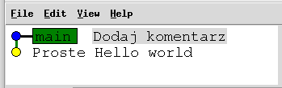 |

Sprawdźmy obecną zawartość pliku `Main.java`. Komentarz
`// a friendly greeting` zniknął:

```java
public class Main {
    public static void main(String[] args) {
        System.out.println("Hello world!");
    }
}
```

Zwróćmy jeszcze uwagę na istotny komunikat, który wypisała komenda
`git checkout`. Git sygnalizuje, że przeszedł w tryb `detached HEAD`. W tym
trybie nie ma aktywnej gałęzi, do której możnaby dodawać commity (etykietka
`main` jest niepogrubiona). Nie warto więc tworzyć nowych commitów, bo jak
przełączymy się z powrotem na gałąź `main`, to te commity po prostu znikną
(w pewnym uproszczeniu).

Wróćmy teraz do aktualnej wersji repozytorium:
```
$ git checkout main
Previous HEAD position was b45ffc0 Proste Hello world
Switched to branch 'main'
```

Gitk potwierdza, że jesteśmy z powrotem w aktualnej wersji:

| Przed | Po |
|---|---|
|  |  |

Zauważmy, że w komendzie powrotnej zamiast hasza commita podaliśmy nazwę gałęzi
(`main`). W przeciwnym razie Git pozostałby w niepożądanym trybie
`detached HEAD`. Git przełączył nas na gałąź `main` (pogrubiona czcionka `main`
w Gitku). Dzięki temu nowe commit będą dodawane do tej właśnie gałęzi i Git je
zapamięta.

**Zadanie 5**
* Utwórz katalog `zadanie5`, rozpakuj w nim repozytorium `przyklady/hello.zip`
  (znowu) i wykonaj `git status`.
* Obejrzyj repozytorium w programie Gitk.
* Cofnij stan projektu do commita *Proste Hello world*.
* Sprawdź, że plik `Main.java` nie zawiera komentarza `// a friendly greeting`.
* Wykonaj `git status` i sprawdź, czy repozytorium jest w stanie
  `detached HEAD`.
* Przywróć stan projektu z powrotem do najnowszego commita.
* Upewnij się, że repozytorium nie jest już w stanie `detached HEAD`.i

## Inne przydatne komendy

1. `git diff` - pokazuje różnice między faktycznym stanem lokalnych plików, a ich wersją przechowywaną w repozytorium
2. `git rebase` - alternatywa dla `git merge`, której powinniśmy używać, kiedy propagujemy zmiany na swojej prywatnej gałęzi (więcej o różnicach między `git merge`  i `git rebase` [tutaj](https://www.atlassian.com/git/tutorials/merging-vs-rebasing))
3. `git stash` - usuwa z projektu niezapisane zmiany i przechowuje je w schowku Gita
4. `git stash pop` - zabiera zmiany przechowywane w schowku Gita i nakłada je na pliki projektu
5. `git reset` - usuwa ostatnie commity, pozostawiając w plikach zawarte w nich zmiany (niezapisane)
6. `git reset --hard` - usuwa ostatnie commity i zawarte w nich zmiany

# Praca ze zdalnym repozytorium

## Wstęp

Jak dotąd pracowaliśmy tylko z lokalnym repozytorium Gita – znajdującym się na
naszym komputerze. W projektach zespołowych potrzebujemy dodatkowo
repozytorium zdalnego. Przesyłamy do niego co jakiś czas kolejne nowe commity,
synchronizując w ten sposób stan projektu z innymi
członkami zespołu. Zdalne repozytorium przydaje się również w projektach
indywidualnych. Pełni wówczas rolę kopii zapasowej na wypadek awarii dysku lub
przypadkowego usunięcia projektu z lokalnego komputera.

## GitLab

Zdalne repozytorium będziemy przechowywać na wydziałowym
[GitLabie](https://gitlab.mimuw.edu.pl). Istnieją również ogólnodostępne serwisy
internetowe oferujące taką funkcjonalność – na przykład
(zewnętrzny) [GitLab](https://about.gitlab.com/),
[GitHub](https://github.com/) czy [Bitbucket](https://bitbucket.org/).

Warto zaznaczyć, że wszystkie komendy Gita, które będziemy wykonywać, jak
i stan repozytoriów, który będziemy na bieżąco śledzić w Gitku, są niezależne
od wyboru serwisu przechowującego zdalne repozytorium. Takie same komendy
wykonalibyśmy, gdybyśmy zamiast GitLaba wybrali np. Bitbucket. Natomiast
wszystkie operacje, które przeklikamy w webowym interfejsie GitLaba, związane
są z tym konkretnym serwisem, więc mogą nieco się różnić od innych serwisów
(choć powinny być podobne).

## Utworzenie zdalnego repozytorium

<!--
  Obrazek niestety wchodzi też częściowo do kolejnej sekcji. Nie znalazłem
  prostej metody poprawienia tego bez pogarszania innych aspektów czytelności
  – więc obecna wersja jest chyba w (lub blisko) optimum.

  Cały tag `img` musi być w jednej linii, bo inaczej IntelliJ nie wyświetli
  obrazka.
-->
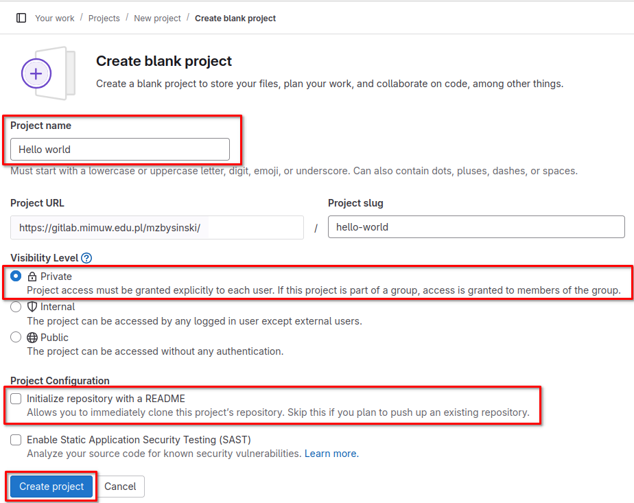

Otwieramy stronę https://gitlab.mimuw.edu.pl/ i logujemy się takimi samymi
danymi jak na komputer wydziałowy. Następnie klikamy przycisk *New project*
i wybieramy opcję *Create blank project*. Wybieramy nazwę projektu, widoczność
prywatną i rezygnujemy z propozycji GitLaba o utworzeniu pliku README dla
naszego repozytorium.

(interfejs GitLaba i zestaw opcji może się zmieniać z czasem – opisy i grafiki
w scenariuszu należy traktować orientacyjnie)

GitLab utworzył dla nas pusty projekt. W głównym widoku projektu proponuje
nam kilka zestawów komend, którymi możemy skonfigurować repozytorium – mogą być
pomocne przy własnych projektach w przyszłości. Konfiguracja jest w dwóch
wersjach – SSH lub HTTPS. My wybierzemy wersję HTTPS – jest prostsza w
konfiguracji, ale wymaga częstszego wpisywania hasła niż SSH. Zrezygnujemy
natomiast z komend sugerowanych przez GitLaba – użyjemy własnych, które łatwiej
będzie prześledzić i zrozumieć krok po kroku.

## Propagacja commitów do zdalnego repozytorium

Wróćmy do wczesnej wersji naszego projektu Hello world
(dobrze znane `hello.zip`):


Nasze lokalne repozytorium jeszcze nie wie o istnieniu (pustego jak
dotąd) repozytorium zdalnego – pora to zmienić!

```
$ git remote add origin \
  https://gitlab.mimuw.edu.pl/WLASCICIEL_REPOZYTORIUM/NAZWA_REPOZYTORIUM.git
```
Napisy `WLASCICIEL_REPOZYTORIUM` i `NAZWA_REPOZYTORIUM` zastępujemy
odpowiednimi wartościami (np. z paska URL przeglądarki; uwaga na sufiks `.git`).
Uwaga: komenda `git remote add` nie sprawdza poprawności podanego adresu –
jeśli pomyliliśmy się przy wpisywaniu, dowiemy się o tym dopiero przy kolejnych
komendach. Należy wówczas usunąć wpis poprzez `git remote remove origin`
i dodać (poprawiony) adres raz jeszcze.

Komendą `git remote add` powiedzieliśmy lokalnemu repozytorium, gdzie szukać
jego zdalnego odpowiednika. Słowo `origin` oznacza główne (zwykle jedyne) zdalne
repozytorium (konwencja nazewnicza). Listę zdalnych repozytoriów (naszego
lokalnego repozytorium) możemy sprawdzić komendą `git remote -v`.

Zdalne repozytorium jest nadal puste. Prześlijmy mu teraz zawartość gałęzi
`main` komendą `git push`. Wykonujemy ją za każdym
razem, gdy chcemy "wypchnąć" nowe commity z gałęzi lokalnego repozytorium do
zdalnego.
```
$ git push
fatal: The current branch main has no upstream branch.
To push the current branch and set the remote as upstream, use

    git push --set-upstream origin main

```
Git jest zdezorientowany, bo nie zdefiniowaliśmy, jaka gałąź w zdalnym
repozytorium ma odpowiadać lokalnej gałęzi `main`. Na szczęście
Git zasugerował komendę, która powinna rozwiązać nasz problem – skorzystajmy z
niej:
```
$ git push --set-upstream origin main

<nieistotne linie>

To https://gitlab.mimuw.edu.pl/mzbysinski/hello-world.git
 * [new branch]      main -> main
Branch 'main' set up to track remote branch 'main' from 'origin'.
```

Git utworzył gałąź `main` w zdalnym repozytorium, powiązał z nią lokalną gałąź
`main` i przesłał z lokalnej gałęzi `main` wszystkie commity do zdalnej gałęzi
`main`. Od teraz, żeby wysłać nowe commity do zdalnej gałęzi `main`, wystarczy
nam bezargumentowa wersja `git push`. Odwzorowanie między gałęziami lokalnego
a zdalnego repozytorium możemy sprawdzić poleceniem
`git remote show origin`.

Zauważmy też, że w Gitku pojawiła się nowa etykietka: `remotes/origin/main`.
Wskazuje ona na najnowszy commit, który jak dotąd przesłaliśmy do zdalnego
repozytorium.

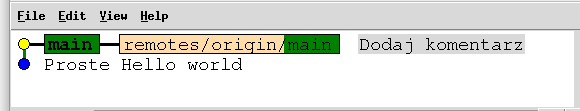

**Zadanie 6a**
* Utwórz katalog `zadanie6`, rozpakuj w nim repozytorium `hello.zip` (znowu)
  i wykonaj `git status`.
* Utwórz nowy projekt na wydziałowym GitLabie i załaduj tam właśnie rozpakowane
  repozytorium.
* Z poziomu GitLaba obejrzyj zawartość pliku `Main.java`.
* (kontynuacja tego zadania będzie na końcu następnej sekcji)

## Typowy sposób pracy ze zdalnym repozytorium

Wyobraźmy sobie, że do naszego projektu dołączyła druga osoba. Przyjrzymy się
teraz:
* w jaki sposób powinna pobrać własną lokalną kopię naszego zdalnego
  repozytorium,
* w jaki sposób może wysłać nowy commit do wspólnego zdalnego repozytorium,
* w jaki sposób my możemy zsynchronizować nasze lokalne repozytorium tak, aby
  zawierało nowy commit dodany przez drugą osobę.

Wyobrażanie sobie pracy za dwie osoby wymaga nieco wysiłku, więc pomóżmy sobie
możliwie klarowną strukturą katalogów:
```
- praca-grupowa
  - ja
    - hello-world
      - Main.java
      - .git
  - druga-osoba
```

Katalog `druga-osoba` jest na razie pusty. Pora sklonować do niego nasze
zdalne repozytorium, wykonując następującą komendę w tym katalogu:
```
$ git clone https://gitlab.mimuw.edu.pl/WLASCICIEL_REPOZYTORIUM/NAZWA_REPOZYTORIUM.git
```
(napisy `WLASCICIEL_REPOZYTORIUM` i `NAZWA_REPOZYTORIUM` oczywiście podmieniamy
na odpowiednie wartości z URLa repozytorium)

Git pobrał repozytorium do katalogu `druga-osoba` i automatycznie
powiązał je z naszym zdalnym repozytorium. Nie musimy się już martwić
o ręczne wykonanie komend w rodzaju `git remote add` czy
`git push --set-upstream`.

Uwaga: W prawdziwym projekcie druga osoba miałaby osobne konto
GitLabowe (inne niż my). Powinniśmy wcześniej dodać tę osobę do projektu na
GitLabie. Można to zrobić w menu *Manage -> Members*.
Jako rolę, w przypadku projektu studenckiego, najwygodniej
przydzielić tej osobie *Maintainer* (ew. *Developer*).

Po sklonowaniu repozytorium struktura katalogów wygląda tak:
```
- praca-grupowa
  - ja
    - hello-world
      - Main.java
      - .git
  - druga-osoba
    - hello-world
      - Main.java
      - .git
```

Przypuśćmy, że druga osoba utworzyła nowego commita (hiszpańskie hello world) w swoim lokalnym
repozytorium. Oto stan obu lokalnych repozytoriów:

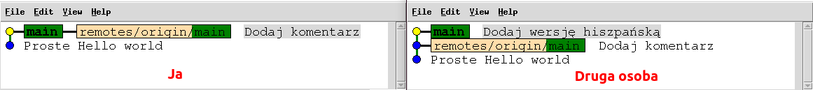

(są w pliku `hello-zdalne.zip` w razie potrzeby)

Hiszpański commit jest na razie tylko w lokalnym repozytorium
drugiej osoby. Załadujmy go teraz do repozytorium zdalnego, wykonując
następującą komendę w katalogu `druga-osoba/hello-world`:
```
$ git push
```

Efekt:

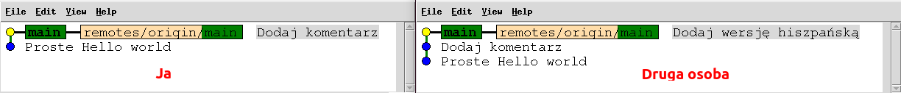

Hiszpański commit pojawił się w zdalnym repozytorium – etykietka
`remotes/origin/main` przesunęła się w Gitku drugiej osoby.
Natomiast nasze lokalne repozytorium nie wie jeszcze o nowym commicie.
Przyda nam się komenda `git fetch`. Aktualizuje ona lokalne repozytorium o wszystkie nowe commity
z repozytorium zdalnego. Wykonajmy ją w katalogu `ja/hello-world`:
```
$ git fetch
```

Efekt:

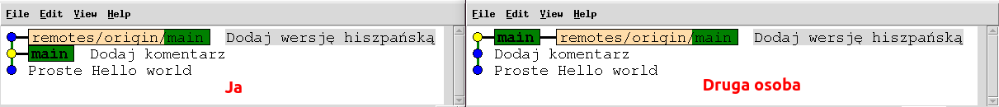

Hiszpański commit pojawił się w naszym lokalnym repozytorium. Zwróćmy uwagę na
istotny szczegół. Etykietka `remotes/origin/main` w naszym repozytorium
przesunęła się do nowego commita, odzwierciedlając stan gałęzi `main` zdalnego
repozytorium. Natomiast etykietka `main` pozostała na swoim miejscu.
`git fetch` pobiera zmiany ze zdalnego repozytorium, natomiast nie synchronizuje
lokalnych gałęzi. Do tej synchronizacji użyjemy (znanego nam) `git merge`
w katalogu `ja/hello-world`:
```
$ git merge origin/main
```
(`origin/main` można opcjonalnie pominąć – domyślnym argumentem `git merge`
jest zdalna gałąź obecnie aktywnej lokalnej gałęzi)

Efekt scalenia:

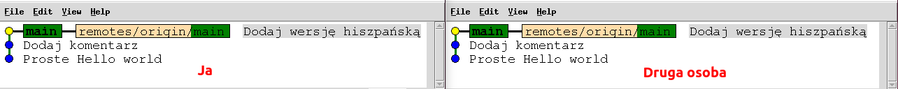

Gałąź `main` naszego lokalnego repozytorium zawiera już hiszpański commit.
Moglibyśmy teraz wrócić do normalnej pracy nad rozwojem projektu.

Wskazówka: Sekwencję `git fetch` + `git merge` można
zastąpić (równoważnym jej) wywołaniem `git pull`. Warto jednak umieć posługiwać
się także `git fetch` i `git merge` z osobna. Może być to pomocne np.
w przypadku konfliktów lokalnych zmian ze zdalnymi.

**Zadanie 6b:**
* Otwórz projekt na GitLabie z poprzedniej części tego zadania (Zadanie 6a).
* Utwórz katalog `ja`, przenieś do niego lokalne repozytorium z zadania 6a
  i wykonaj w nim `git status`.
* Utwórz katalog `druga-osoba` i sklonuj do niego zdalne repozytorium z
  GitLaba.
* W repozytorium z katalogu `ja` utwórz nowego commita
  * Np. dodającego wypisywanie komunikatu
    `"It's a bit much of hello world for one day, isn't it?"`.
* Załaduj tego commita do zdalnego repozytorium.
* Sprawdź, że nowy komunikat pojawił się w pliku `Main.java` na GitLabie.
* Zsynchronizuj repozytorium `druga-osoba` z nowymi zmianami ze zdalnego
  repozytorium.
* Upewnij się, że plik `Main.java` w repozytorium `druga-osoba` zawiera nowy
  komunikat.

## Organizacja pracy w projekcie zespołowym

Aby nad projektem zespołowym pracowało się wygodnie i wydajnie, warto
wprowadzić kilka dodatkowych zasad obsługi repozytorium, które w pracy
indywidualnej nie są konieczne. W pracy zespołowej nowych commitów zwykle nie
tworzymy bezpośrednio na gałęzi `main`. Zamiast tego każdą nową funkcjonalność
implementujemy na osobnej nowej
gałęzi. Gdy funkcjonalność jest już gotowa, prosimy wtedy inną osobę z
zespołu o inspekcję kodu (*code review*). Po zrealizowaniu uwag
recenzenta włączamy gałąź z naszą funkcjonalnością do gałęzi głównej.

Taki tryb pracy można wygodnie realizować np. w GitLabie. Dokładniejszy opis
jest w dodatku [Praca zespołowa](#praca-zespołowa) u dołu scenariusza.

# Graficzne alternatywy do Gita w terminalu

IntelliJ IDEA automatycznie wykryje istniejące repozytorium Git, jeżeli w otwartym katalogu takie istnieje. Jeżeli właśnie utworzyliśmy nowy projekt przy pomocy IDE lub otworzyliśmy katalog, w którym nie ma jeszcze repozytorium, możemy je w prosty sposób stworzyć. Wystarczy otworzyć dropdown menu `VCS` (Version Control System) z górnego paska interfejsu i wybrać opcję `Create Git Repository...`. Po utworzeniu repozytorium, menu `VSC` zostanie zastąpione przez menu `Git`. Zobaczymy tam znajome już nazwy, a interfejs pozwoli "wyklikać" wszystko w przyjazny sposób. Na przykład wybór `Show Git Log` otworzy nam nową zakładkę, w której oprócz listy commitów zobaczymy graficzne przedstawienie zawartej w nich historii.

Wygodnym programem do obsługi Gita jest też [GitTortoise](https://tortoisegit.org/) (tylko Windows). Pozwala on na prostą obsługę Gita z poziomu menu kontekstowego, bez konieczności użycia linii komend. Użytkownicy innych systemów mogą wypróbować Git GUI (część standardowego pakietu Gita) lub licznych alternatywnych programów tego rodzaju dostępnych w internecie.

# Serwisy internetowe wspierające pracę z Gitem

Istnieje kilka serwisów internetowych, które oferują swoim użytkownikom dostęp do zdalnych repozytoriów Git. Najbardziej popularne spośród nich to:
1. [GitHub](https://github.com/)
2. [GitLab](https://about.gitlab.com/)
3. [Bitbucket](https://bitbucket.org/)

Serwisy takie mają wiele możliwości, a założenie na nich prywatnego konta jest zazwyczaj darmowe. Przy pomocy takiego serwisu możemy na przykład:
1. Stworzyć nasze repozytorium, którego stan będzie przechowywany na serwerach dostawcy serwisu. Dzięki temu będziemy mogli sklonować je na każdą maszynę, na której aktualnie pracujemy. Nie ryzykujemy też, że nasza praca przepadnie wskutek awarii naszego prywatnego nośnika danych.
2. Udostępnić nasze repozytorium innym, umożliwiając wygodną pracę niezależnym programistom. Główne repozytorium jest dostępne przez cały czas z serwerów dostawcy serwisu, zatem nie musimy hostować go sami. Ponadto możemy ustawić odpowiednie uprawnienia dla repozytorium, na przykład zezwalać na przeglądanie go wszystkim użytkownikom, ale na modyfikowanie - jedynie wybranym. W ten sposób rozwijanych jest wiele projektów otwartoźródłowych.
3. Zdefiniować w naszym repozytorium systemy [CI/CD](https://pl.wikipedia.org/wiki/Ci%C4%85g%C5%82a_integracja). Większość serwisów oferuje użytkownikom możliwość automatyzowania różnych czynności. Na przykład za każdym razem, gdy ktoś zrobi `merge` do gałęzi `main`, serwis zbuduje projekt przy pomocy wskazanych przez nas skryptów i przetestuje gotowy program. Różne serwisy posługują się w tym celu swoją własną składnią. Na przykład GitHub oferuje deklaratywne definiowanie akcji w plikach `yaml` umieszczonych w projekcie w specjalnym katalogu `.github/workflows` - [GitHub Actions](https://github.com/features/actions).

# Materiały do dalszej nauki
System kontroli wersji Git jest obecnie standardem w pracy programistów i jego znajomość jest w wielu sytuacjach konieczna. Informacje z tego scenariusza powinny wystarczyć do pracy nad projektami na tym przedmiocie, jednakże Git oferuje o wiele więcej możliwości. Więcej materiałów do nauki można znaleźć w internecie, na przykład [tutaj](https://www.atlassian.com/git/tutorials) i [tutaj](https://learngitbranching.js.org/) (forma bardziej interaktywna).

# Dodatki

## Instalacja

Do zrealizowania scenariusza potrzebny jest program Git i Gitk.

Na Linuxie wystarczy zainstalować pakiety `git` i `gitk`
(lub po prostu pakiet `git-all`). Np. na Ubuntu byłaby to komenda
`sudo apt-get install git` (i analogicznie dla `gitk`).

Na Windowsie wystarczy pobrać i zainstalować pakiet *Git for Windows*
(https://git-scm.com/downloads/win). Po zainstalowaniu pakietu uruchamiamy
program *Git Bash* i wpisujemy tam dowolne komendy Gita tak, jak w scenariuszu
(Git Bash zachowuje się jak Linuxowy terminal). Program Gitk uruchamiamy z
poziomu Git Bash standardową komendą `gitk --all &`.

## Konfiguracja

### Chcę tylko szybko rozwiązać problemy z sekcji Pierwszy commit

Nazwę i adres mailowy użytkownika można ustawić komendami:

```bash
$ git config --global user.name ab123456
$ git config --global user.email ab123456@students.mimuw.edu.pl
```

A edytor tekstu ustawia się tak:

```bash
$ git config --global core.editor nano
```

Link powrotny do sekcji [Pierwszy commit](#pierwszy-commit).

### Chcę poznać metody konfigurowania Gita

Git jest wysoce konfigurowalny, do czego służy komenda `git config`. Git rozpoznaje trzy poziomy konfiguracji: lokalny, globalny i systemowy.
1. Poziom lokalny aplikuje się do akcji podejmowanych w danym repozytorium, a konfiguracja jest przechowywana katalogu repozytorium w pliku `.git/config`.
2. Poziom globalny aplikuje się do akcji podejmowanych przez danego użytkownika systemu, a konfiguracja jest przechowywana w pliku `~/.gitconfig` (`~` to skrót oznaczający katalog domowy użytkownika).
3. Poziom systemowy aplikuje się do wszystkich akcji podejmowanych w systemie, a konfiguracja jest przechowywana w pliku zależnym od konkretnego systemu, na przykład `/etc/gitconfig`.

 W każdym z nich mamy dostęp do tych samych opcji. Szukając swojej konfiguracji, Git patrzy kolejno na konfigurację lokalną, globalną i systemową. Zatrzymuje się na pierwszej konfiguracji, w której znajduje się wartość dla danej opcji.

 Żeby globalnie ustawić w Git nazwę i adres mailowy użytkownika, należy posłużyć się następującymi komendami:

 ```bash
 $ git config --global user.name ab123456
 $ git config --global user.email ab123456@students.mimuw.edu.pl
 ```

Jeżeli w konkretnym repozytorium chcemy przedstawiać się inaczej, należy wejść do niego i dostosować konfigurację lokalną.

```bash
$ cd /sciezka/do/repozytorium
$ git config --local user.name ktos_inny
$ git config --local user.email ktos_inny@mail.com
```

Innym przydatnym ustawieniem jest program do edycji tekstu, przy pomocy którego Git będzie umożliwiał nam tworzenie komentarzy do commitów:

```bash
$ git config --global core.editor nano
```

lub

```bash
$ git config --global core.editor vim
```

lub dowolny preferowany edytor.

Żeby poznać wszystkie opcje ustawione w konfiguracji można posłużyć się komendą `git config --list`. Jeżeli interesuje nas konkretny poziom konfiguracji, możemy wywołać tę komendę tak samo jak komendy wyżej.

```bash
$ git config --local --list
$ git config --global --list
$ git config --system --list
```

## Konflikty

Git całkiem dobrze radzi sobie z uzgadnianiem commitów modyfikujących ten sam
plik – widzieliśmy to na przykładzie z sekcji
[Scalenie trójstronne](#scalanie-trójstronne).
Czasami jednak Git nie jest w stanie rozstrzygnąć jaki powinien być
rezultat scalenia (np. gdy dwie gałęzie modyfikują tę samą linię na dwa różne
sposoby) – taką sytuację nazywamy konfliktem (*merge conflict*). W takim
przypadku Git poprosi nas o ręczne określenie, jak powinny wyglądać fragmenty,
co do których nie ma pewności.

Weźmy na warsztat przykład z wypisywaniem argumentów, którego intensywnie
używaliśmy w części o gałęziach. Tym razem jednak na gałęzi `main`
zaimplementujmy zamianę wszystkich wielkich
liter w argumentach programu na małe litery (np. jeśli ujednolicenie wielkości
liter miałoby nam ułatwić implementację dalszej logiki programu).

Oto stan naszego repozytorium:

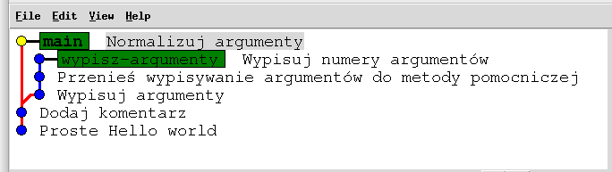

I plik `Main.java` na każdej z gałęzi:

<!--
  Brak wcięć w tabeli i puste linie okalające bloki kodu są tutaj istotne:
  https://stackoverflow.com/questions/28508141/code-block-inside-table-row-in-markdown
-->
<table>
<tr>
<th>main</th><th>wypisz-argumenty</th>
</tr>
<tr style="vertical-align:top">
<td>

```Java
public class Main {
    public static void main(String[] args) {
        normalizeArguments(args);

        System.out.println("Hello world!"); // a friendly greeting
    }

    private static void normalizeArguments(String[] args) {
        for (int i = 0; i < args.length; i++) {
            args[i] = args[i].toLowerCase();
        }
    }
}
```

</td>
<td>

```Java
public class Main {
    public static void main(String[] args) {
        printArguments(args);

        System.out.println("Hello world!"); // a friendly greeting
    }

    private static void printArguments(String[] args) {
        System.out.println("Arguments:");
        for (int i = 0; i < args.length; i++) {
            System.out.printf("Argument %d: %s\n", i, args[i]);
        }
    }
}
```

</td>
</table>

(W razie potrzeby repozytorium w tym stanie można obejrzeć w pliku
`hello-konflikty.zip`.)

Spróbujmy teraz wcielić zmiany z gałęzi `wypisz-argumenty` do gałęzi `main`:
```bash
$ git merge wypisz-argumenty
Auto-merging Main.java
CONFLICT (content): Merge conflict in Main.java
Automatic merge failed; fix conflicts and then commit the result.
```

Git rozpoczął scalanie, ale napotkał konfliktujące zmiany w pliku `Main.java`.
Sprawdźmy, co o stanie repozytorium powie nam `git status`:
```
$ git status
On branch main
You have unmerged paths.
  (fix conflicts and run "git commit")
  (use "git merge --abort" to abort the merge)

Unmerged paths:
  (use "git add <file>..." to mark resolution)
	both modified:   Main.java

no changes added to commit (use "git add" and/or "git commit -a")
```
Repozytorium weszło w stan procedury scalania i Git częściowo zmodyfikował
już plik `Main.java`. Żeby doprowadzić repozytorium do normalnego stanu,
musimy wykonać jakąś akcję. Jeśli się rozmyśliliśmy i chcemy wrócić do stanu
sprzed procedury scalania, możemy wykonać podpowiedziane przez Gita
`git merge --abort`. Drugą opcją jest ręczne rozstrzygnięcie konfliktów
i dokończenie scalania – i właśnie tym się teraz zajmiemy.

Git oznaczył wszystkie konfliktujące fragmenty, modyfikując plik `Main.java`
w następujący sposób:
```Java
public class Main {
    public static void main(String[] args) {
<<<<<<< HEAD
        normalizeArguments(args);

        System.out.println("Hello world!"); // a friendly greeting
    }

    private static void normalizeArguments(String[] args) {
        for (int i = 0; i < args.length; i++) {
            args[i] = args[i].toLowerCase();
        }
    }
}
=======
        printArguments(args);

        System.out.println("Hello world!"); // a friendly greeting
    }
>>>>>>> wypisz-argumenty

    private static void printArguments(String[] args) {
        System.out.println("Arguments:");
        for (int i = 0; i < args.length; i++) {
            System.out.printf("Argument %d: %s\n", i, args[i]);
        }
    }
}
```
Każdy konflikt w pliku (w tym przypadku jest tylko jeden) ujęty jest w dwie
(sztucznie dodane przez Gita) linie – początkowa linia oznaczona jest przez
`<<<<<<<` a końcowa przez `>>>>>>>`. Dwie konfliktujące wersje rozdzielone
są linią z `=======`.

Naszym zadaniem jest teraz ręczne poukładanie tego pliku tak, jak chcemy, żeby
wyglądał po scaleniu (możemy modyfikować go w dowolny sposób). Na koniec
warto upewnić się, że w pliku nie została żadna ze wspomnianych sztucznie
dodanych linii – kompilator Javy nie byłby zachwycony, gdyby
napotkał w kodzie np. tajemniczy operator `<<<<<<<`.

Konflikty możemy rozstrzygnąć np. do następującej postaci:
```Java
public class Main {
    public static void main(String[] args) {
        printArguments(args);
        normalizeArguments(args);

        System.out.println("Hello world!"); // a friendly greeting
    }

    private static void printArguments(String[] args) {
        System.out.println("Arguments:");
        for (int i = 0; i < args.length; i++) {
            System.out.printf("Argument %d: %s\n", i, args[i]);
        }
    }

    private static void normalizeArguments(String[] args) {
        for (int i = 0; i < args.length; i++) {
            args[i] = args[i].toLowerCase();
        }
    }
}
```
Po wprowadzeniu zmian plik zapisujemy a następnie za pomocą `git add`
sygnalizujemy, że wszystkie konflikty w tym pliku już rozstrzygnęliśmy:
```bash
$ git add Main.java
```

Git status potwierdza, że Git jest już gotowy do dokończenia scalania:
```bash
$ git status
On branch main
All conflicts fixed but you are still merging.
  (use "git commit" to conclude merge)

Changes to be committed:
	modified:   Main.java
```

Wykonujemy `git commit`, zatwierdzamy domyślny tytuł commita i scalanie
zakończone:
```bash
$ git commit
[main 1c004d2] Merge branch 'wypisz-argumenty'
```

Plik `Main.java` wygląda teraz dokładnie tak, jak ręcznie go zapisaliśmy,
a struktura repozytorium jest następująca:

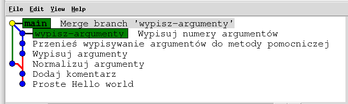

**Zadanie:**
* Rozpakuj repozytorium `hello-konflikty.zip`.
* Włącz zmiany z gałęzi `wypisz-argumenty` do gałęzi `main`. Konflikty
  rozstrzygnij tak, aby:
  * wypisywanie argumentów odbywało się już po ich normalizacji,
  * definicja metody `normalizeArguments` była w pliku wyżej niż definicja
    metody `printArguments`.
* Usuń gałąź `wypisz-argumenty`.

## Praca zespołowa

### Ogólny obraz

W sekcji [Praca ze zdalnym repozytorium](#praca-ze-zdalnym-repozytorium)
zobaczyliśmy podstawowy sposób synchronizowania postępów pracy, który mógłby
się sprawdzić np. w niedużym dwuosobowym projekcie studenckim. W większych
projektach sposób pracy jest jednak zwykle bardziej skomplikowany:
* Pracę nad daną funkcjonalnością wykonujemy na osobnej gałęzi (a nie
  bezpośrednio na gałęzi `main`). Kolejne etapy pracy dodajemy jako osobne
  commity do tej gałęzi. 
* Gdy funkcjonalność jest już ukończona, zgłaszamy wtedy w GitLabie (lub w
  innym podobnym serwisie) chęć
  włączenia gałęzi z naszą funkcjonalnością do gałęzi `main`. Takie zgłoszenie
  nazywa się *merge request* (GitLab) lub *pull request* (GitHub, Bitbucket) –
  obie nazwy znaczą w praktyce to samo.
* Zarządca repozytorium (lub inny uczestnik projektu) wykonuje inspekcję
  kodu (*code review*) i sygnalizuje w GitLabie, które fragmenty naszego kodu
  należy poprawić.
* Wykonujemy odpowiednie poprawki (dodając kolejne commity do naszej gałęzi)
  i prosimy o ponowne obejrzenie kodu. Wykonujemy kolejne rundy poprawek, aż
  dojdziemy z recenzentem do konsensusu, że kod nadaje się do włączenia do
  głównej gałęzi.
* Zarządca repozytorium (lub my sami, jeśli mamy odpowiednie uprawnienia)
  włącza naszą gałąź do gałęzi głównej (`git merge`); często z poziomu
  interfejsu GitLaba.

### Jak to wygląda w praktyce

Przećwiczmy teraz opisany tryb pracy na przykładowym projekcie w GitLabie.

Utwórzmy w GitLabie nowy projekt i załadujmy do niego nasz przykład Hello world
(`hello.zip`)
tak, jak zrobiliśmy to w sekcji *Praca ze zdalnym repozytorium*:

```bash
$ git remote add origin https://gitlab.mimuw.edu.pl/WLASCICIEL_REPOZYTORIUM/NAZWA_REPOZYTORIUM.git

$ git push --set-upstream origin main
```

Utwórzmy teraz nową gałąź `jezyki` i utwórzmy na niej dwa commity
dodające wypisywanie *Hello world* w kilku językach. Przykładowe
repozytorium z tak przygotowaną gałęzią jest w archiwum
`hello-merge-request.zip`.

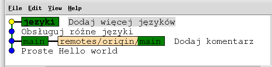

Utworzymy zaraz merge request gałęzi `jezyki` do gałęzi `main` w GitLabie.
Najpierw jednak musimy załadować gałąź `języki` do zdalnego repozytorium:
```bash
$ git push --set-upstream origin jezyki
```

Gałąź trafiła do zdalnego repozytorium. Otwórzmy teraz w GitLabie menu
*Code > Merge requests* i kliknijmy przycisk *New merge request*. Wybieramy
`jezyki` jako gałąź źródłową, `main` jako gałąź docelową i zatwierdzamy.
Następnie uzupełniamy opis proponowanych zmian, uzupełniamy pola *Assignee*
(kto pracował nad daną funkcjonalnością) i *Reviewer* (osoba, którą prosimy
o inspekcję kodu), a na koniec zatwierdzamy przyciskiem *Create merge request*:

| Część 1/3 | Część 2/3 | Część 3/3 |
|---|---|---|
| 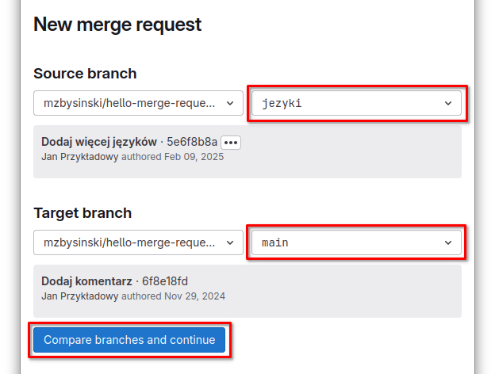 | 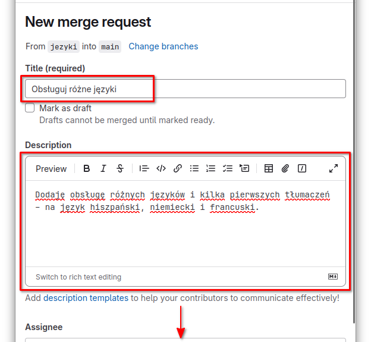 | 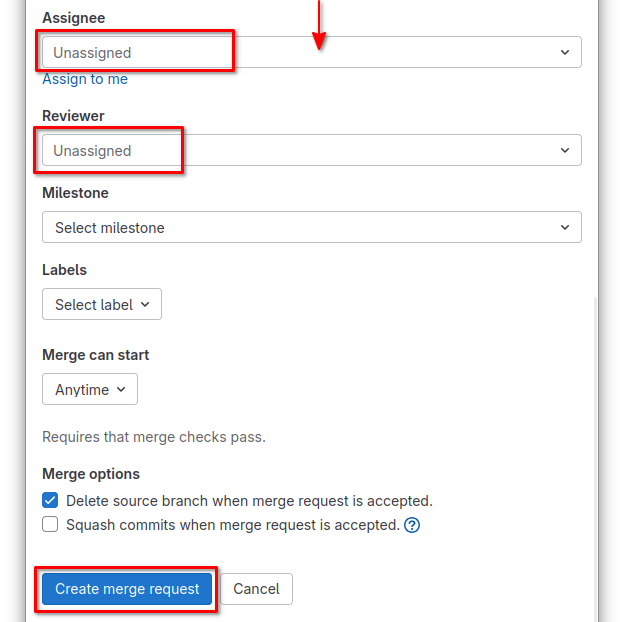 |

Utworzyliśmy właśnie merge request.

W zakładce *Changes* możemy zobaczyć, jakie konkretnie zmiany w kodzie
wprowadza nasz merge request.
Recenzent kodu wygodnie umieszcza komentarze bezpośrednio przy liniach pliku,
których dany komentarz dotyczy. W trakcie wykonywania inspekcji kodu recenzent
dodaje komentarze w stanie *Pending* (nie wysyła ich od razu autorowi) a na
koniec publikuje je wszystkie na raz przyciskiem *Finish review*. Dzięki temu
autor dostaje powiadomienie (mejlowe) dopiero w momencie, gdy informacja
zwrotna jest kompletna (unikamy w ten sposób niepotrzebnych powiadomień po
każdym komentarzu).

Teraz autor powinien wdrożyć zaproponowane zmiany, utworzyć z nich commita
(lub kilka commitów) i wykonać `git push`. GitLab automatycznie zakutalizuje
widok *Changes* o nowe zmiany. Autor powinien jeszcze odpowiedzieć na każdy
z komentarzy recenzenta – w minimalnej wersji wystarczy "Zrobione" i oznaczenie
wątku jako zrealizowany (*Resolved*).
Opublikowanie komentarzy autora jest sygnałem dla recenzenta, że kod jest
gotowy do ponownej inspekcji. Jeśli autor nie zgadza się z częścią uwag recenzenta,
może zacząć dyskusję pod odpowiednimi komentarzami.

| Zakładka *Changes* w trakcie inspekcji kodu | Zakładka *Overview* po opublikowaniu uwag |
| --- | --- |
| 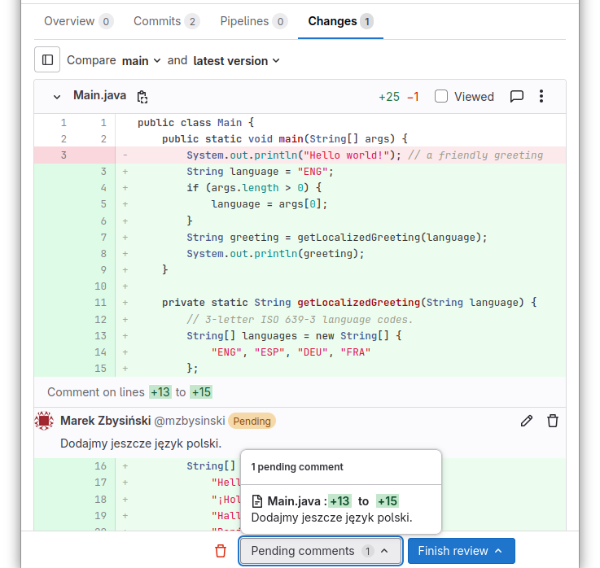 | 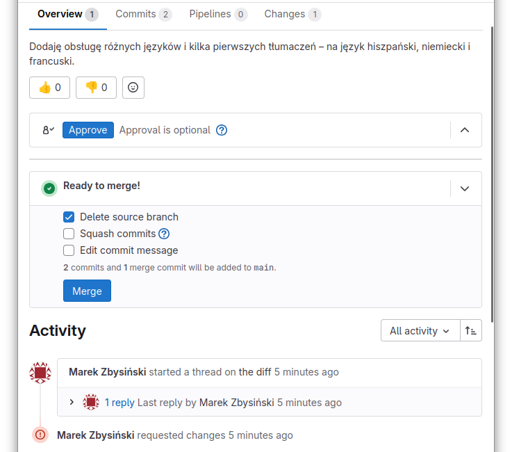 |

Gdy recenzent jest już zadowolony z postaci naszego kodu, sygnalizuje to
przyciskiem *Approve*. Możemy wtedy wcielić nasze zmiany do głównej gałęzi
przyciskiem *Merge*. GitLab wykona wtedy `git merge` na zdalnym repozytorium
i zakończy naszą procedurę merge request.

Po wykonaniu scalenia aktualizujemy stan naszego lokalnego repozytorium za
pomocą `git fetch`. Efekt:

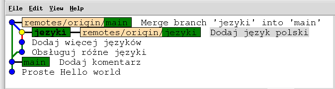

Teraz trzeba jeszcze dosunąć lokalną gałąź `main` do jej zdalnego odpowiednika
(`git merge`, jak w sekcji *Praca ze zdalnym repozytorium*).

Niepotrzebną już lokalną gałąź `jezyki` usuwamy za pomocą znanego nam
`git branch -d jezyki`.

Z kolei zdalną gałąź `origin/jezyki` usuwamy z poziomu GitLaba – chyba że
GitLab sam to już wcześniej zrobił (opcja *Delete source branch* procedury
merge request). Etykietki wszystkich nieistniejących już zdalnych gałęzi
(w naszym przypadku jednej) usuwamy z lokalnego repozytorium za pomocą:
```bash
$ git fetch --prune
```

Efekt końcowy:

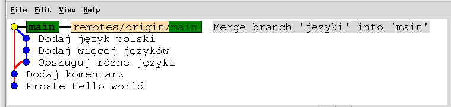
